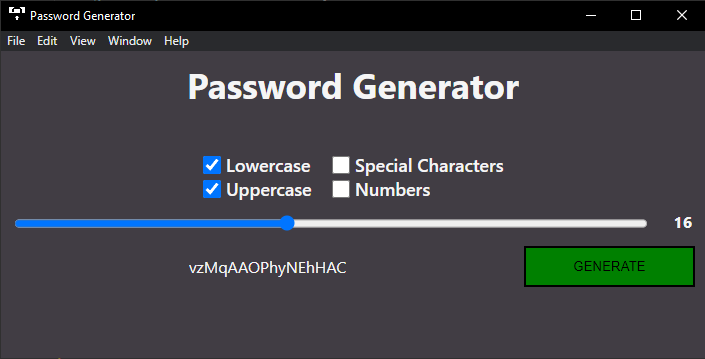

# Password Generator Electron App
A very simple Password Generator, wrote in Python (Engine) with the Electrion framework (Interface). 

The user chooses what kind of generation it wants, such as, the length of the password or if will have special characters and uppercases.

## How to Run
Clone the Repo, then use npm install and lastly npm start to run the electron script.

## Use Case Example
